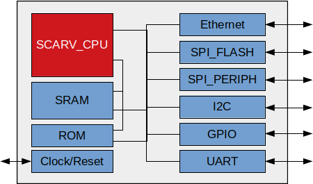

# SCARV SoC Requirements

*This document describes the design requirements for the SCARV SoC in terms
of features and target performance characteristics.*

---

## SoC Block Diagram

## Requirements Overview

- The SoC will be implementable primarily on an FPGA.

  - The SoC will be implementable on an ASIC with minimal changes.

  - The number of FPGA specific blocks within the design will be minimised.
    Initially, some vendor specific IP blocks may be used for bring-up, but
    these should be replaced with free/open-source components eventually.

- The SoC will use the [SCARV CPU](https://github.com/scarv/scarv-cpu) core.

  - The CPU core will be augmented with the 
    [XCrypto](https://github.com/scarv/xcrypto)
    instruction set extensions.

  - The CPU core will be capable of running the [Zephyr](https://zephyrproject.org)
    RTOS.

- The SoC will have access to 64Kb of on-chip SRAM.

- The SoC will support several common peripherals:

  - SPI flash controller.

  - Standalone SPI peripheral controller.

  - UART Serial Interface.
  
  - I2C Serial Interface.

  - 16 GPIO Pins.

  - One external interrupt pin.

- The SoC will optionally support a network interface (Ethernet / WiFi)

  - This will be based on existing open source or vendor specific designs.

- The SoC must fit into a Artix-7 Xilinx FPGA, running at 100MHz.

